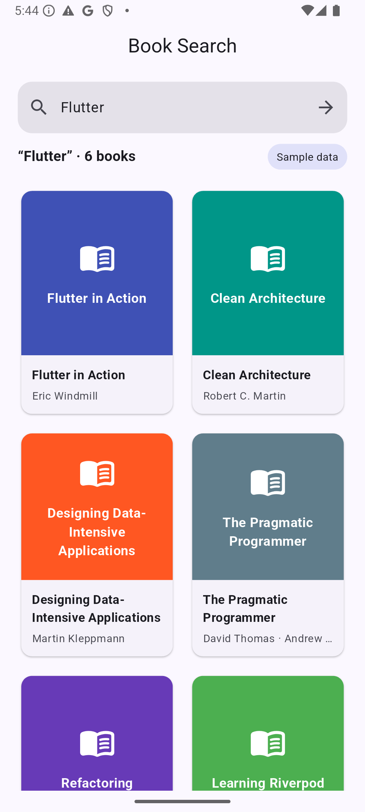

# Flutter Book Search App

책 검색 API 결과를 Flutter UI에 연결하면서 Riverpod 기반 상태 관리, 검색 입력, grid rendering, 상세 bottom sheet 흐름을 연습한 프로젝트입니다.

A Flutter practice app for connecting a book-search API to a Riverpod-managed search UI, grid results, and a detail bottom sheet.

## UI Preview / 구현 화면



이 이미지는 Android Emulator에서 기본 앱을 실행해 검색창과 2열 결과 카드가 함께 보이는 상태를 캡처한 것입니다. 포트폴리오 preview는 외부 API credential 없이도 재현되도록 **명시적인 sample data mode**를 사용합니다.

This screenshot is captured from the default app on an Android Emulator. The portfolio preview uses an explicit **sample-data mode** so the search/result UI remains reproducible without committing API credentials.

## Features / 주요 구현

- 검색어 입력 및 submit/search action
- Riverpod ViewModel 상태 구독
- 검색 결과를 모바일 친화적인 2-column card grid로 표시
- 책 표지 이미지를 네트워크 이미지로 렌더링
- 결과 선택 시 상세 정보를 bottom sheet로 표시
- DTO → domain model → repository → ViewModel → UI 흐름 연습
- API credential이 없거나 요청이 실패하면 sample data로 안전하게 fallback

## Structure / 구조

```text
lib/
├── data/
│   ├── dto/                 # API response DTO
│   ├── model/               # Book domain model
│   └── repository/          # search repository
├── ui/pages/home/
│   ├── home_page.dart       # search + result grid
│   ├── home_view_model.dart # Riverpod state
│   └── widgets/             # detail bottom sheet
└── main.dart
```

## Run / 실행

```bash
flutter pub get
flutter run
```

Naver Book Search를 live mode로 사용하려면 credential을 소스에 넣지 말고 실행 시 전달합니다.

```bash
flutter run \
  --dart-define=NAVER_CLIENT_ID=... \
  --dart-define=NAVER_CLIENT_SECRET=...
```

## Validate / 검증

2026-08-20 기준 dependency resolution, static analysis, Android build/run을 다시 검증했습니다. 외부 검색 API는 선택적인 live mode이며 README 대표 화면은 credential이 필요 없는 sample mode입니다.

As of 2026-08-20, dependency resolution, static analysis, and Android build/run were re-validated. The external API is optional; the README preview deliberately uses credential-free sample data.
