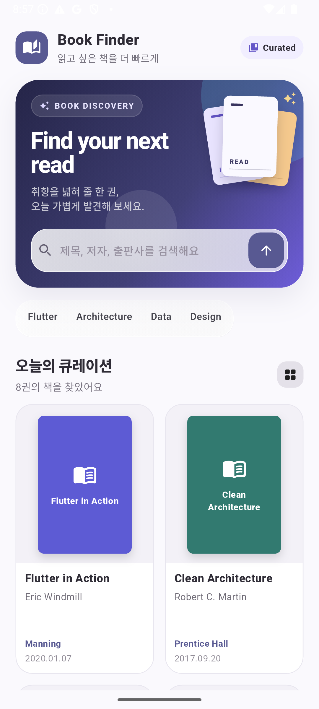
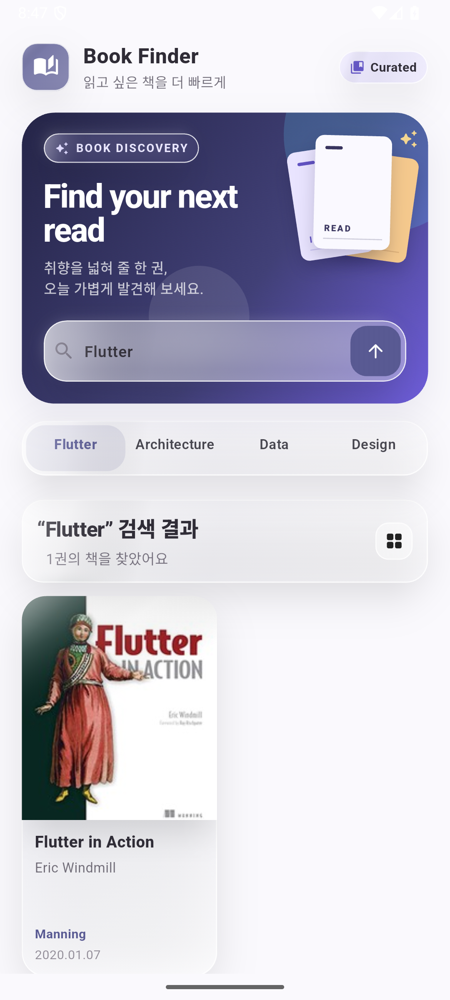
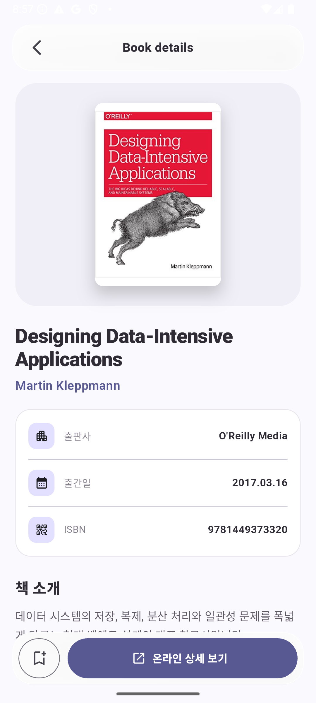
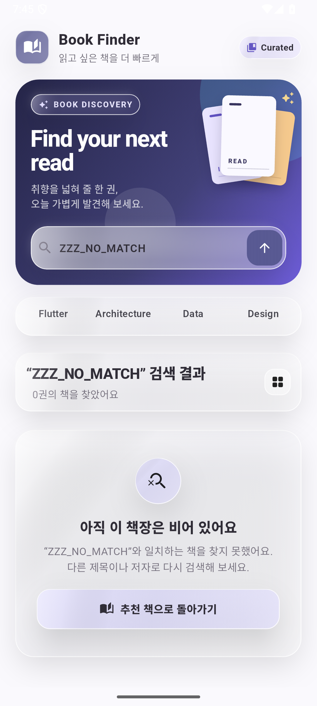

# Book Finder

Flutter와 Riverpod으로 만든 모바일 **Book Discovery 앱**입니다. 책을 검색하고 2열 discovery shelf에서 표지와 메타데이터를 비교한 뒤, 상세 화면에서 책 소개와 ISBN을 확인하고 온라인 상세 페이지로 이어지는 흐름을 구현했습니다.

Naver Book Search API를 연결할 수 있으며, credential이 없는 환경에서는 재현 가능한 curated sample 데이터로 동일한 검색·empty state·detail flow를 확인할 수 있습니다.

## Preview

<p align="center">
  
  
  
</p>

<p align="center">
  
</p>

대표 이미지는 Flutter Web이 아니라 **Android 15 / API 35 Emulator**에서 실제 앱을 실행하고 interaction한 뒤 캡처했습니다.

## What it does

- discovery hero와 `Flutter`, `Architecture`, `Data`, `Design` 빠른 탐색
- 제목·저자·출판사 기반 검색과 검색 결과 count 표시
- cover / title / author / publisher / publication date를 비교하는 2-column card grid
- 검색 중 loading skeleton과 검색 결과가 없을 때 empty state 제공
- 큰 표지, 저자, 출판사, 출간일, ISBN, 소개를 보여주는 book detail 화면
- 관심 목록 demo action과 온라인 상세 페이지 CTA
- 네트워크 이미지 실패 시 cover fallback
- API credential이 없거나 live 요청이 실패해도 curated fallback으로 탐색 흐름 유지

## Architecture

```text
HomePage
  → HomeViewModel (Riverpod)
    → BookRepository
      → Naver Book Search API / curated fallback
        → DTO → Book
```

UI와 데이터 접근 책임을 분리했고, API 응답의 `<b>` 같은 markup은 `Book` 생성 시 정리해 화면에 그대로 노출되지 않도록 했습니다.

## Tech Stack

- Flutter / Dart
- Material 3
- Riverpod
- `http` — Naver Book Search REST API
- `flutter_inappwebview` — 온라인 상세 페이지
- Flutter Test

## Run

Credential 없이 curated portfolio mode로 실행:

```bash
flutter pub get
flutter run
```

Naver Book Search API를 사용하는 경우 credential은 source에 저장하지 않고 `--dart-define`으로 전달합니다.

```bash
flutter run \
  --dart-define=NAVER_CLIENT_ID=... \
  --dart-define=NAVER_CLIENT_SECRET=...
```

## Validation

이번 포트폴리오 마무리 과정에서 실제로 확인한 결과입니다.

- `flutter analyze` — **0 issues**
- `flutter test` — **4 tests passed**
- Android debug APK build — **PASS**
- Android 15 / API 35 Emulator install & run — **PASS**
- `Design` 검색 — **3 results 확인**
- no-match 검색 — **empty state 확인**
- result card → detail navigation — **PASS**
- runtime log — **RenderFlex overflow / image exception / fatal exception 없음**
